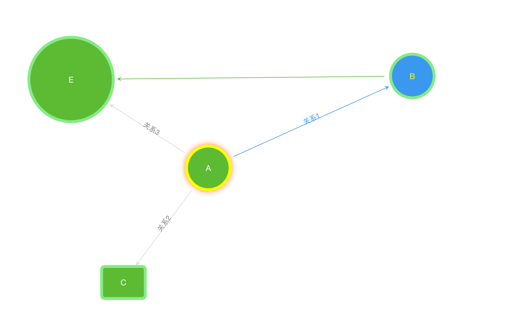
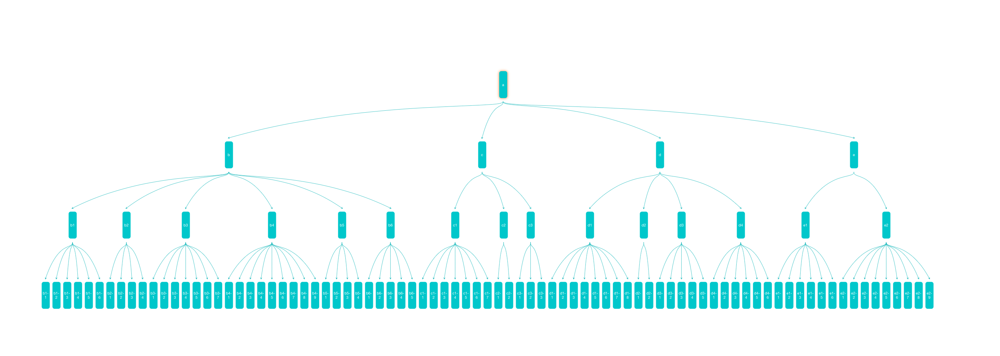
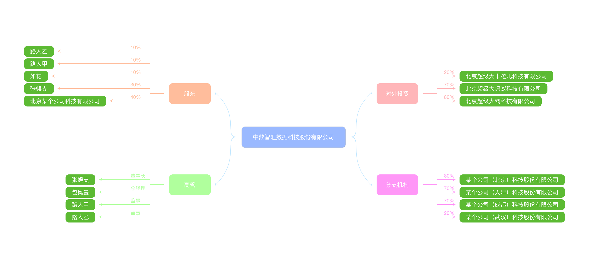
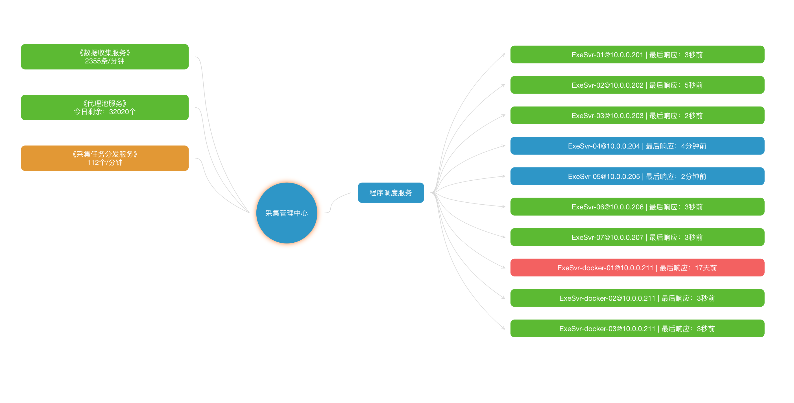
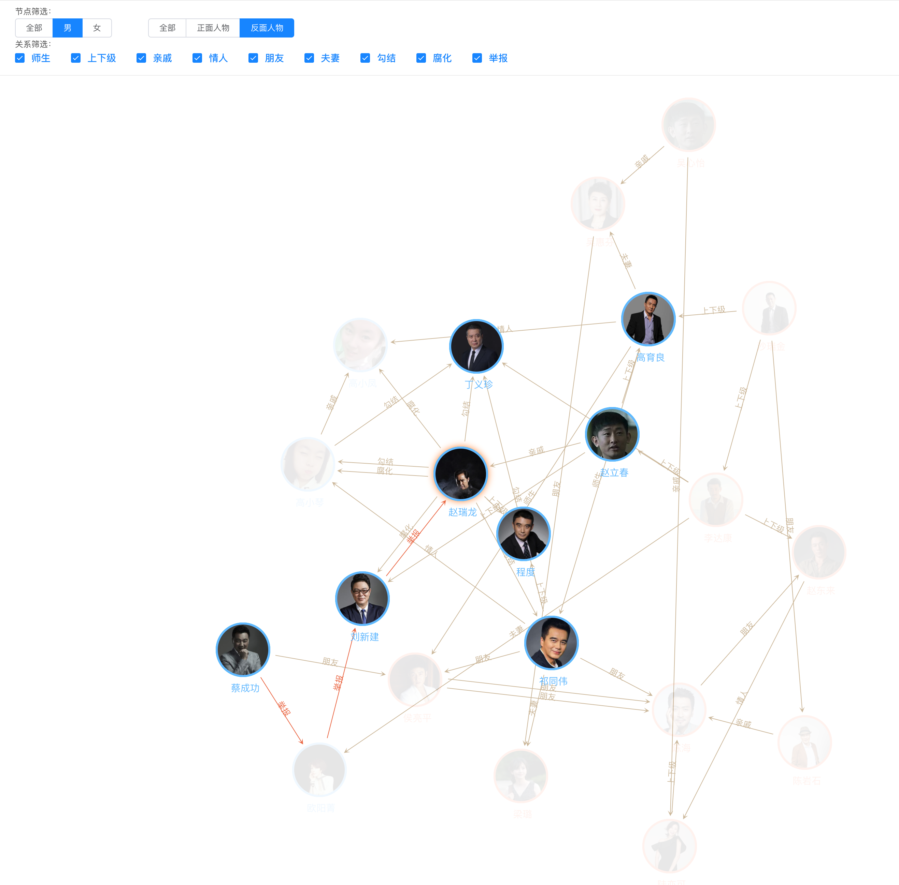
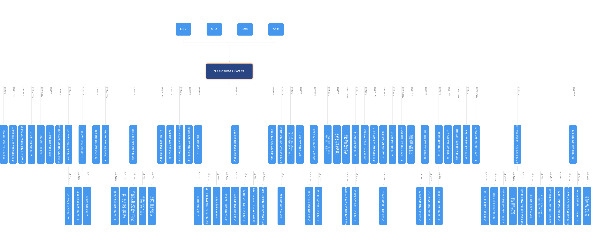
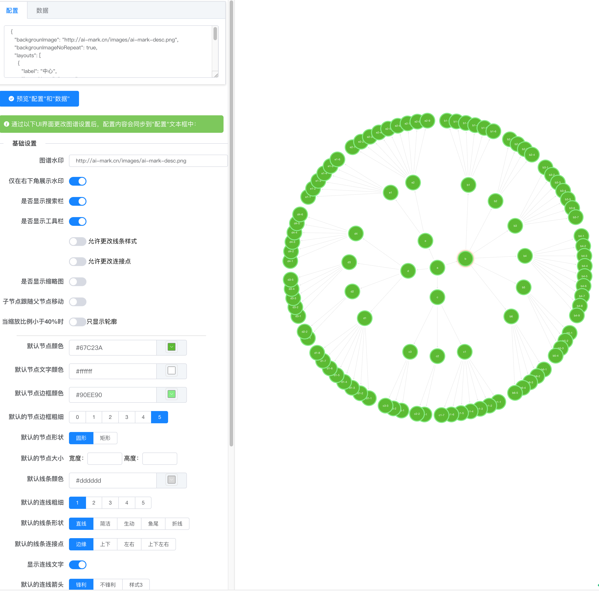

*relation-graph*
---

这是一个Vue关系图谱组件，可以展示如组织机构图谱、股权架构图谱、集团关系图谱等知识图谱，可提供多种图谱布局，包括树状布局、中心布局、力学布局自动布局等。

这个项目使用典型的vue编程方式，代码简单易懂。如果需要实现一些自定义的高级功能，你可以直接使用源码作为一个component放到你的项目中去用，轻松、任意的修改。

*详细使用方法、配置选项、在线demo，以及可视化的配置工具，可以访问这个网址：*

http://relation-graph.com

---
*快速使用：*
```shell script
npm install --save relation-graph
```
```vue
<template>
   <div>
     <div style="height:calc(100vh - 50px);">
        <RelationGraph ref="seeksRelationGraph" :options="graphOptions" :on-node-click="onNodeClick" :on-line-click="onLineClick" />
     </div>
   </div>
 </template>
 
 <script>
 import RelationGraph from 'relation-graph'
 export default {
   name: 'Demo',
   components: { RelationGraph },
   data() {
     return {
       graphOptions: {
         allowSwitchLineShape: true,
         allowSwitchJunctionPoint: true,
         defaultJunctionPoint: 'border'
         // 这里可以参考"Graph 图谱"中的参数进行设置:http://relation-graph.com/#/docs/graph
       }
     }
   },
   mounted() {
     this.showSeeksGraph()
   },
   methods: {
     showSeeksGraph() {
       var __graph_json_data = {
         rootId: 'a',
         nodes: [
            // node配置选项：http://relation-graph.com/#/docs/node
            // node支持通过插槽slot完全自定义，示例：http://relation-graph.com/#/demo/adv-slot
           { id: 'a', text: 'A', borderColor: 'yellow' },
           { id: 'b', text: 'B', color: '#43a2f1', fontColor: 'yellow' },
           { id: 'c', text: 'C', nodeShape: 1, width: 80, height: 60 },
           { id: 'e', text: 'E', nodeShape: 0, width: 150, height: 150 }
         ],
         links: [
            // link配置选项：http://relation-graph.com/#/docs/link
           { from: 'a', to: 'b', text: '关系1', color: '#43a2f1' },
           { from: 'a', to: 'c', text: '关系2' },
           { from: 'a', to: 'e', text: '关系3' },
           { from: 'b', to: 'e', color: '#67C23A' }
         ]
       }
       this.$refs.seeksRelationGraph.setJsonData(__graph_json_data, (seeksRGGraph) => {
         // Called when the relation-graph is completed 
       })
     },
     onNodeClick(nodeObject, $event) {
       console.log('onNodeClick:', nodeObject)
     },
     onLineClick(lineObject, $event) {
       console.log('onLineClick:', lineObject)
     }
   }
 }
 </script>
```
*上面代码的效果：*














*更多效果及使用方法：*
http://relation-graph.com
---
*最新版本v1.0.9：*

主要修改的问题：
* 1，解决了当使用者没有使用element-ui时图谱工具栏样式异常的问题
* 2，默认关闭组件中的打印信息，只有在设置debug时打印信息
* 3，解决了_graph.removeNodeById方法的bug
* 4，解决了当图谱大小调整后调用refresh方法无法让图谱位置居中的问题
* 5，解决了当调整图谱大小后工具栏位置不自动调整的问题
* 6，解决了无法将图谱数据放在Vue data()中的问题

新特性：
* 1，提供一种新布局：固定位置布局《fixed/固定坐标布局》，介绍：http://relation-graph.com/#/docs/layout  示例：http://relation-graph.com/#/demo/layout-diy
* 2，提供getGraphJsonData和getGraphJsonOptions方法，获取图谱中当前所有数据和配置信息的json数据
* 3，提供图谱配置：禁用图谱缩放、禁用工具栏缩放按钮的配置
* 4，提供节点配置：禁用节点拖拽、禁用节点点击的默认选中效果

---

v1.1.0即将推出，新特性：
* 1  支持连线的长度设置（目前树状布局已支持，请参考：http://relation-graph.com/#/docs/layout 中的章节《tree / 树状布局 特有的选项》）
* 2，对于树状数据的支持，即通过{text:a,children: [{b},{c},{d}] }这样的方式定义数据，免去树形图谱的数据扁平化转换。
* 3，优化导出图片功能
* 4，你可以联系我，告诉我你想要的特性


这个项目使用典型的vue编程方式，代码简单易懂，如果需要实现一些高级功能，你还可以直接使用源码作为一个component放到你的项目中去用，如果有一些优化或者新特性，欢迎提交pull request。

如果这个项目能帮到大家，有更多的人关注，后续我会开发用于小程序、react、angular的版本，以及基于canvas的实现。

有问题可以加QQ：3235808353，提bug、提建议、一起交流分享前端开发心得。


